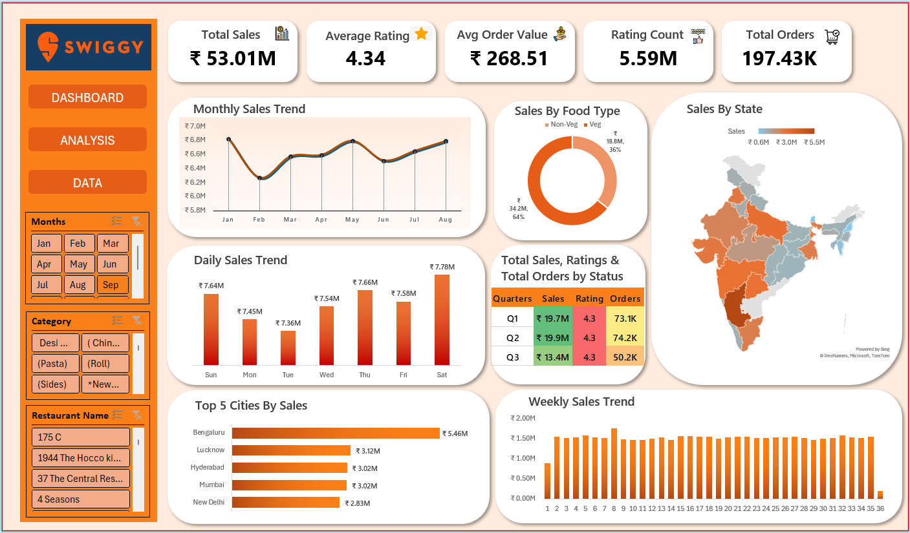

# Swiggy Sales Analysis Dashboard (Jan–Aug 2025)
A look at ~197K Swiggy food delivery orders, built in Excel using Pivot Tables, slicers, and a KPI-driven dashboard. The goal was to dig into sales trends over time, see how food preferences split, and find out which states and cities actually drive the revenue.



⚠️ **Note:** The dataset only covers January–August, so Q3 only contains two months (Jul–Aug) instead of three. The drop you see in Q3 isn't a real decline — it's an incomplete quarter.

## 📊 Dataset

- **Source:** Kaggle
- **Size:** ~197,430 order-level records
- **Raw fields:** State, City, Order Date, Restaurant Name, Location, Category, Dish Name, Price (INR), Rating, Rating Count
- **Engineered fields:** Day, Week, and Quarter (derived from Order Date), and Food Type (Veg/Non-Veg, derived from Dish Name)

## 🎯 Business Questions

### 1. Is the business growing, shrinking, or holding steady month to month?
Monthly sales stayed remarkably flat across the eight months of data, ranging narrowly between ₹6.27M (February, the lowest) and ₹6.83M (May, the highest) — a spread of less than 9%. This points to steady, consistent demand rather than a growth or decline trend.

💡 **Recommendation:** Since demand looks stable rather than seasonal, use month-over-month comparisons mainly to catch anomalies (a sudden spike or dip) rather than to track growth — growth would need to be measured against a longer time window than 8 months.


### 2. Do customers actually prefer Veg or Non-Veg food?
Veg orders generated ₹34.18M (64%) of total revenue, compared to ₹18.83M (36%) for Non-Veg — nearly double.

💡 **Recommendation:** Given the strong Veg skew, prioritize Veg menu expansion and inventory availability over Non-Veg. It would also be worth checking whether this 64/36 split holds consistently across all states, or whether it's driven by a few large Veg-heavy regions.


### 3. Which states and cities are actually driving the revenue?
Karnataka leads by a wide margin at ₹5.46M — more than 75% higher than the next closest state, Uttar Pradesh (₹3.12M). Cross-checking the city-level breakdown shows why: Bengaluru alone accounts for ₹5.46M, matching Karnataka's entire state total almost exactly.

💡 **Recommendation:** Don't read this as "Karnataka is a strong statewide market" — it's really "Bengaluru is a strong single-city market." Any state-level rollout or resourcing decision should look at the city-level breakdown first, since a state map alone can hide this kind of concentration.


### 4. Which days of the week actually drive the most orders?
Saturday is the strongest day (₹7.78M), followed by Sunday (₹7.64M) and Thursday (₹7.66M). Tuesday is the weakest (₹7.36M) — though the spread between best and worst day is only about 5.7%, so demand is fairly even across the week rather than being weekend-only.

💡 **Recommendation:** Since the weekday/weekend gap is small, staffing and promotions probably don't need to swing dramatically by day — the bigger lever here is likely food type or category, not day of week.


## 🖥️ The Dashboard

Built a single-page dashboard so everything's visible at a glance — monthly and weekly sales trends, a Veg/Non-Veg breakdown, a state-by-state map, daily sales, quarterly performance, and top cities — with slicers to filter by Month, Category, or Restaurant Name. KPI cards up top (Total Sales, Average Rating, Avg Order Value, Rating Count, Total Orders) update automatically as you filter.


## 🛠️ How the Extra Columns Were Built

The raw data only had 10 columns. Four more were engineered with formulas before this analysis was possible:

```
Day     = TEXT([@[Order Date]],"ddd")
Week    = WEEKNUM([@[Order Date]])
Quarter = "Q"&INT((MONTH([@[Order Date]])-1)/3)+1

Food Type =IF(OR(
    ISNUMBER(SEARCH("chicken",J3)),
    ISNUMBER(SEARCH("egg",J3)),
    ISNUMBER(SEARCH("fish",J3)),
    ISNUMBER(SEARCH("mutton",J3)),
    ISNUMBER(SEARCH("prawn",J3)),
    ISNUMBER(SEARCH("biryani",J3)),
    ISNUMBER(SEARCH("kabab",J3)),
    ISNUMBER(SEARCH("kebab",J3)),
    ISNUMBER(SEARCH("Non-Veg",J3)),
    ISNUMBER(SEARCH("non veg",J3))
    ),"Non-Veg","Veg")
```

`SEARCH` was used over `FIND` since it's case-insensitive. One known limitation: a dish like "Veg Biryani" would still get flagged Non-Veg by this keyword match — a tighter version would need to check for "veg" prefixes before the non-veg keyword list.

## 📁 Access the File

- 📥 [Swiggy_Data.xlsx](Swiggy_Data.xlsx)

## ✅ Conclusion

Swiggy's order volume held steady across the 8 months analyzed, with Veg food driving nearly two-thirds of all revenue and Karnataka's strong state-level number really coming down to one city, Bengaluru. Building this end-to-end — engineering missing columns with formulas, connecting slicers across multiple PivotTables, and getting a Filled Map chart working — reinforced how much of "data analysis" is really about correctly reading what a number is (and isn't) telling you before drawing a conclusion from it.
